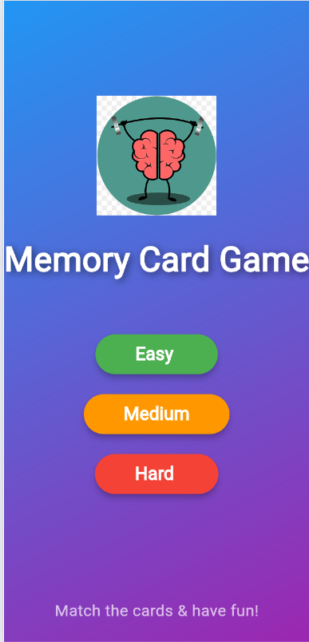
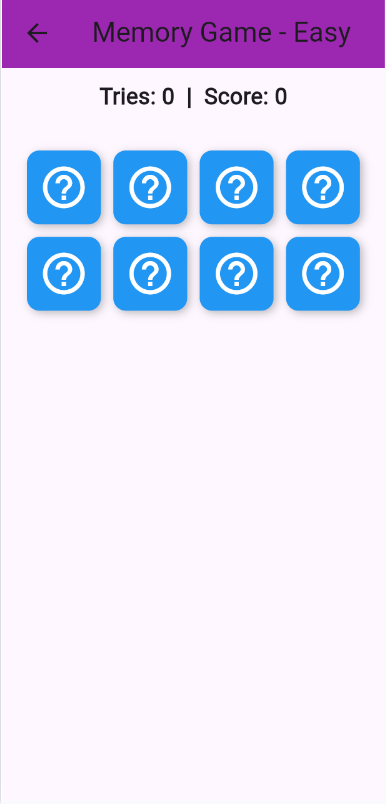
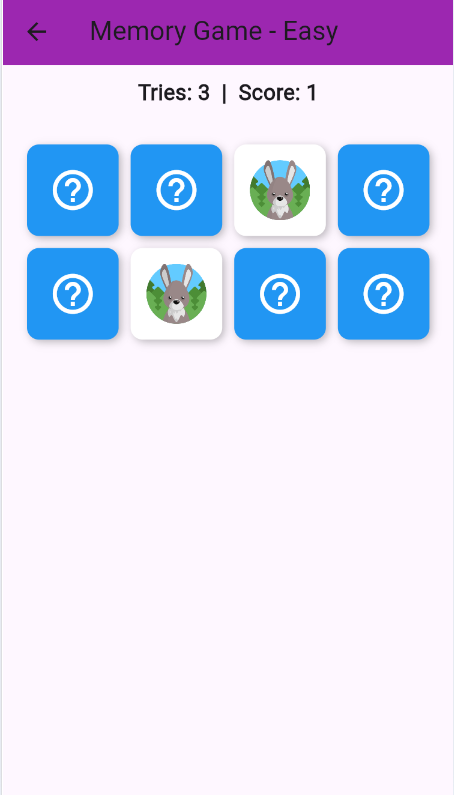
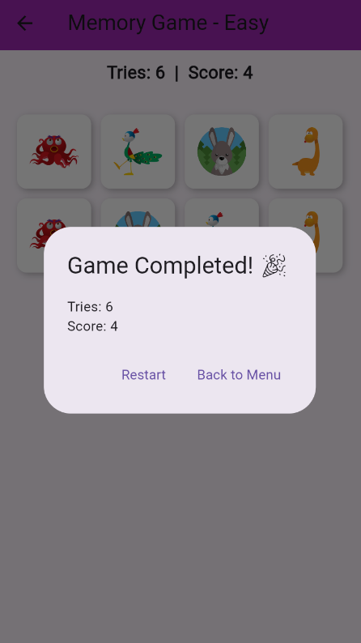

# 🎮 Memory Card Game Flutter Game App

## 📌 Project Name

**Memory Card Game** is a fun and simple mobile game built with **Flutter** and **Dart**. Users can select levels and play by tapping the screen. The app features smooth navigation, a responsive dark theme, and a clean user interface. It serves as a great example of creating interactive and well-structured Flutter applications.

---

## ✨ Key Features

- **Landing Page** with the game title and a “Start Game” button.
- **Level Selection Screen** allowing users to choose from multiple game levels.
- **Game Page** displaying the selected level with tap-based interactions and dynamic updates.
- **Smooth Navigation** using `Navigator.push` for seamless transitions between screens.
- **Dark Theme** and **Responsive Layout** optimized for both mobile and tablet.
- **User-Friendly Interface** with a clean and minimal design.

---

## 🧰 Tech Stack

- **Framework:** Flutter  
- **Language:** Dart  
- **UI Components:** `Scaffold`, `MaterialApp`, `ElevatedButton`, `Navigator`, `Column`, `Center`, `Text`, `AppBar`  
- **IDE & Tools:** Visual Studio Code  
- **Platform:** Flutter

---

## 🚀 How to Run the Project

### Prerequisites:

- **Flutter SDK:** Install from [flutter.dev](https://flutter.dev)
- **VS Code:** Install one IDE and configure Flutter & Dart plugins.
- **Device/Emulator:** Ensure a device or emulator is available for testing.

### Steps:

```bash
# Clone the Repository
git clone https://github.com/your-username/tap-and-play.git
cd tap-and-play
```

```bash
# Get Dependencies And Packages
flutter pub get
```

```bash
# Run the App
-Ensure a device or emulator is connected.
-Use the following command:

flutter run
```

```bash
# Optional: Build for Release
flutter build apk --release
```
## Open in VS Code / Android Studio:
Navigate to the project folder.
Open the project and hit the Run
▶️ button or use the terminal.

---

## 🖼️ Screens Overview

### 1. 🏁 Start Page
-	On Run ➝ routes to level selector
- Includes level selection button.



### 2. 🕹️ Game Page
- Displays/Title: `"Memory Game - Level Easy / Medium / Hard"`
- Interactive cards to flip and match.

<p float="left">
  
  &nbsp;
  
</p>


### 3. 🧠 Game End Page
- Shows final **score**
- Includes a **“Back to Menu”** option.



## 📁 File Structure

| File Name         | Responsibility                                 |
|-------------------|-------------------------------------------------|
| `main.dart`       | App entry point, MaterialApp, routing setup     |
| `start_page.dart` | Home screen with navigation to levels           |
| `game_level.dart` | Level selection UI and navigation logic         |
| `game_page.dart`  | Game logic per level and dynamic UI updates     |
---
## 📘 What I Learned

- Built a multi-screen app using **Flutter** and **Dart** with clean navigation  
- Designed a responsive, dark-themed UI using Flutter widgets  
- Handled interactive logic and state updates in **Dart**  
- Applied best practices in **Flutter** app structure and code organization  
  ---
 ## 📬 Contact
- For any queries or contributions, feel free to open an issue or submit a pull request.
